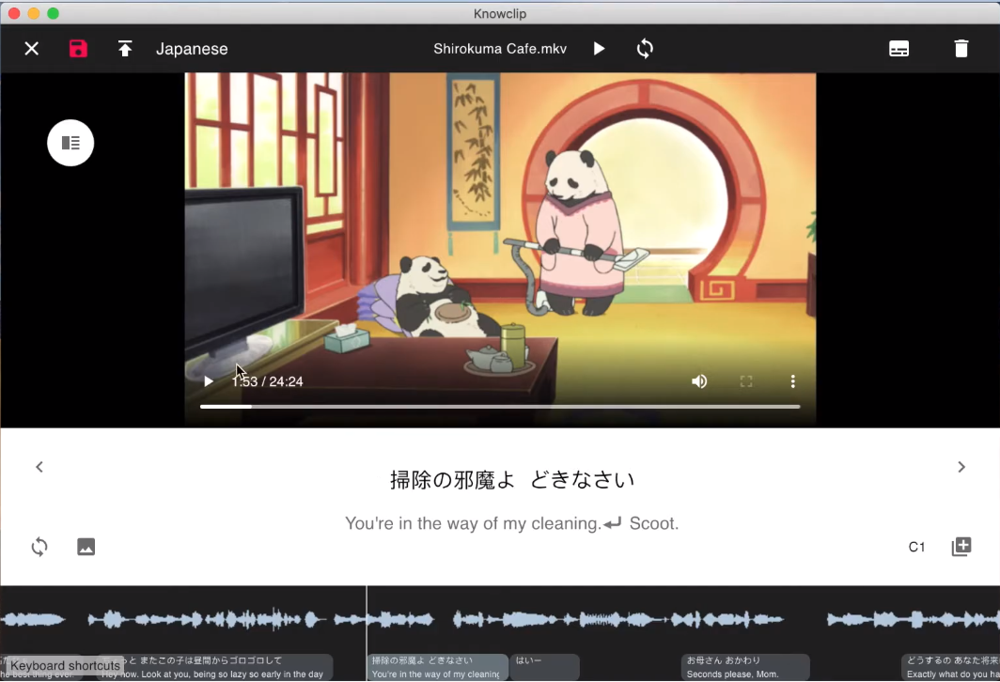

# Knowclip


A cross-platform desktop application for turning audio and video files into flashcards.

It works like this:

1. Choose a media file.
2. Make your clips (manually or automatically).
3. Export your audio flashcards for use in [Anki](https://apps.ankiweb.net/).

Currently being built with [Electron](https://electronjs.org), [Create React App](https://github.com/facebookincubator/create-react-app), [Redux](https://redux.js.org/) and [RxJS](https://rxjs-dev.firebaseapp.com/). Audio processing is done with [ffmpeg](https://ffmpeg.org/).

### Demo: [Making cards automatically with subtitled video](https://www.youtube.com/watch?v=kFEfS8dyKQ8)
[](https://www.youtube.com/watch?v=Duy8f4bOa-Y)


### Development

To install NPM packages, use [Yarn](https://yarnpkg.com/):

```bash
npm install
```

Once packages are installed, you may run the dev build:

```bash
npm start
```

Wait until you see that see a message about compilation completed (some warnings are OK). Then, in another terminal tab, open the Electron app:

```bash
npm run electron
```

### Tests

Tests are run with [Jest](https://jestjs.io/) via [Create React App](https://create-react-app.dev/docs/running-tests/).

#### Unit tests

```bash
npm run test
```

#### Integration tests

Integration tests use [Spectron](https://electronjs.org/spectron) to make sure all the parts of the app are working together.

```bash
npm run integration
```


The disadvantage of integration tests is that they are slow to run. To speed things up while debugging them and writing new ones, you can run these scripts instead:

```bash
# run a dev server configured for integration tests
npm run start:integration

# run integration tests without closing
# the app at the end so you can inspect it
npm run integration:debug
```

#### Test CLI options

Any arguments you pass to the test scripts will be [forwarded to Jest](https://jestjs.io/docs/en/cli).

So if you wanted to say, run just one specific test, you can do something like this:

```bash
npm test -- -t "clips reducer"
```

